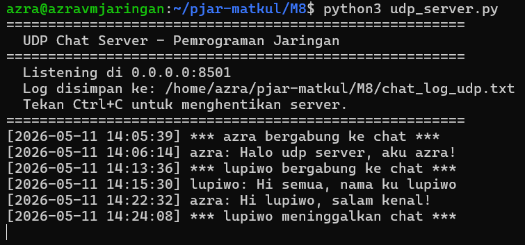
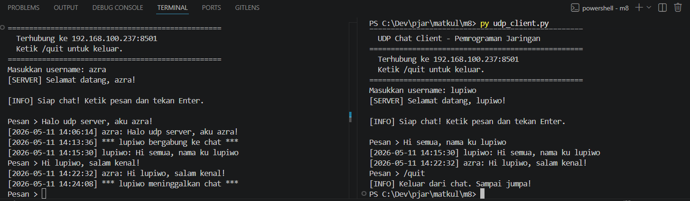
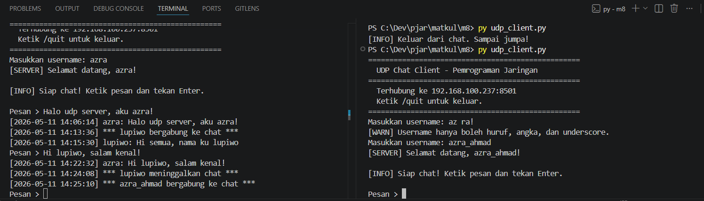
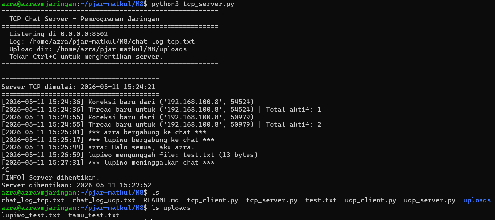
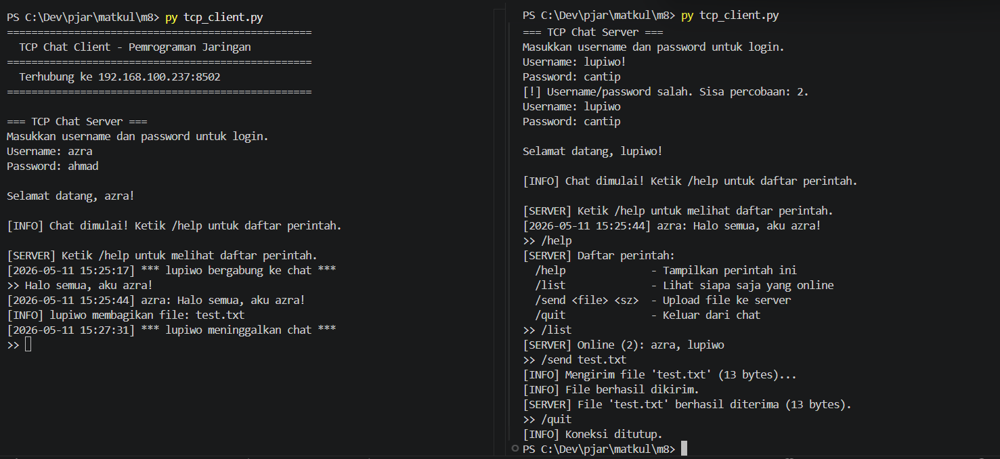

# Tugas M8 - Pemrograman Socket UDP dan TCP

Project ini berisi implementasi aplikasi chat sederhana menggunakan socket programming di Python. Program dibagi menjadi dua bagian utama, yaitu chat berbasis UDP dan chat berbasis TCP.

Link repository Github: https://github.com/azra-ahmad/pjar-matkul/

## Informasi Project

- Mata kuliah: Pemrograman Jaringan
- Bahasa: Python
- Mode tampilan: Command Line Interface (CLI)
- Protokol: UDP dan TCP
- Platform pengujian: Server di VM, client di Windows lokal

## Struktur File

```text
M8/
|-- udp_server.py        # Server UDP
|-- udp_client.py        # Client UDP
|-- tcp_server.py        # Server TCP
|-- tcp_client.py        # Client TCP
|-- test.txt             # File contoh untuk pengujian upload TCP
|-- screenshot/
|   |-- udp_server.png
|   |-- udp_client.png
|   |-- udp_salahLogin.png
|   |-- tcp_server.png
|   `-- tcp_client.png
`-- README.md
```

## Penjelasan Program

### 1. UDP Chat

Program UDP terdiri dari `udp_server.py` dan `udp_client.py`. Server menerima paket dari beberapa client, menyimpan daftar client aktif, lalu melakukan broadcast pesan ke semua client yang sedang terdaftar.

Alur kerja UDP:

1. Client memasukkan username.
2. Client mengirim paket `REGISTER:<username>` ke server.
3. Jika username valid, server menyimpan alamat client.
4. Client dapat mengirim pesan dengan format `MSG:<username>:<pesan>`.
5. Server memformat pesan menjadi `[timestamp] username: pesan`.
6. Pesan dicetak di terminal server, disimpan ke file log, dan dikirim ke client lain.
7. Client dapat keluar dengan perintah `/quit`.

### 2. TCP Chat

Program TCP terdiri dari `tcp_server.py` dan `tcp_client.py`. Server berjalan dengan model multi-connection menggunakan thread, sehingga beberapa client dapat terhubung dan chat secara real-time.

Alur kerja TCP:

1. Client terhubung ke server TCP.
2. Server meminta username dan password.
3. Jika login berhasil, client masuk ke ruang chat.
4. Setiap pesan biasa akan dibroadcast ke semua user online.
5. Client juga dapat menjalankan command seperti `/list`, `/send`, `/help`, dan `/quit`.
6. File yang dikirim client akan disimpan di folder `uploads/` pada sisi server.

## Fitur Program

### Fitur UDP

- Server dapat menerima pesan dari lebih dari satu client.
- Broadcast pesan ke semua client aktif.
- Logging pesan ke file `chat_log_udp.txt`.
- Format pesan menggunakan timestamp dan username.
- Validasi username:
  - Tidak boleh kosong.
  - Maksimal 20 karakter.
  - Hanya boleh huruf, angka, dan underscore.
- Validasi pesan:
  - Tidak boleh kosong.
  - Maksimal 300 karakter.
- Error handling untuk input tidak valid dan koneksi server.

### Fitur TCP

- Server dapat menangani multiple client menggunakan threading.
- Autentikasi sederhana dengan username dan password.
- Chat real-time antar client.
- Command-based system:
  - `/help` untuk menampilkan daftar perintah.
  - `/list` untuk melihat user yang sedang online.
  - `/send <file>` untuk upload file ke server.
  - `/quit` untuk keluar dari chat.
- Logging aktivitas ke file `chat_log_tcp.txt`.
- Pengiriman file dari client ke server.
- File upload disimpan di folder `uploads/`.
- Validasi ukuran file maksimal 10 MB.
- Validasi pesan maksimal 500 karakter.
- Error handling untuk login gagal, command tidak dikenal, file tidak ditemukan, dan koneksi terputus.

## Akun Login TCP

| Username | Password |
| --- | --- |
| `azra` | `ahmad` |
| `lupiwo` | `cantip` |
| `tamu` | `1234` |

Data akun dapat diubah melalui dictionary `USER_DB` pada file `tcp_server.py`.

## Konfigurasi IP dan Port

Server menggunakan IP `0.0.0.0` agar dapat menerima koneksi dari jaringan luar. Client perlu diarahkan ke IP server atau IP VM.

```python
SERVER_IP = "192.168.100.237"
```

Port yang digunakan:

| Program | Protokol | Port |
| --- | --- | --- |
| `udp_server.py` | UDP | `8501` |
| `tcp_server.py` | TCP | `8502` |

Jika menggunakan firewall di VM, pastikan port sudah dibuka:

```bash
sudo ufw allow 8501/udp
sudo ufw allow 8502/tcp
```

## Cara Menjalankan Program

### Menjalankan UDP

Jalankan server UDP terlebih dahulu:

```bash
python udp_server.py
```

Atau jika menggunakan Linux/VM:

```bash
python3 udp_server.py
```

Lalu jalankan client UDP di terminal lain:

```bash
python udp_client.py
```

Setelah username berhasil didaftarkan, client dapat langsung mengirim pesan. Gunakan `/quit` untuk keluar dari chat.

### Menjalankan TCP

Jalankan server TCP terlebih dahulu:

```bash
python tcp_server.py
```

Atau jika menggunakan Linux/VM:

```bash
python3 tcp_server.py
```

Lalu jalankan client TCP di terminal lain:

```bash
python tcp_client.py
```

Login menggunakan salah satu akun yang tersedia, lalu gunakan chat atau command yang disediakan.

Contoh upload file pada TCP:

```text
>> /send test.txt
```

## Screenshot Hasil Running

### UDP Server



### UDP Client



### UDP Validasi Input



### TCP Server



### TCP Client



## Output File yang Dihasilkan

Saat program dijalankan, beberapa file/folder tambahan dapat terbentuk:

| File/Folder | Keterangan |
| --- | --- |
| `chat_log_udp.txt` | Log pesan dan aktivitas server UDP |
| `chat_log_tcp.txt` | Log pesan dan aktivitas server TCP |
| `uploads/` | Folder penyimpanan file hasil upload dari client TCP |