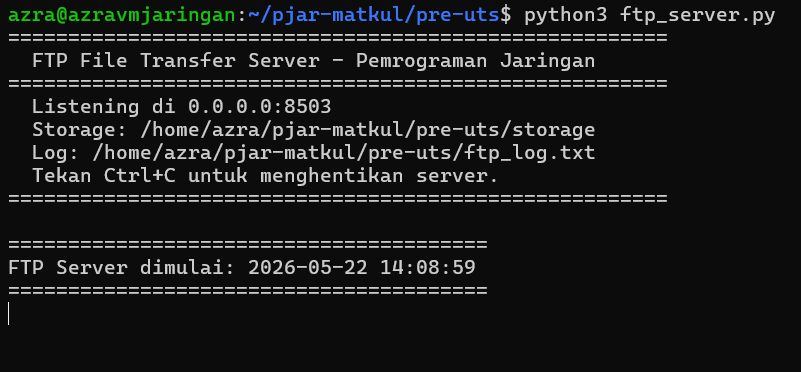
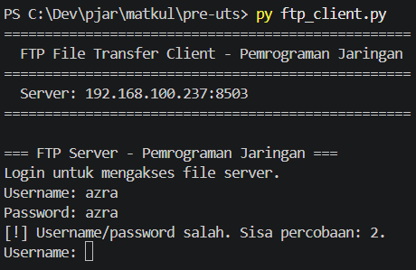
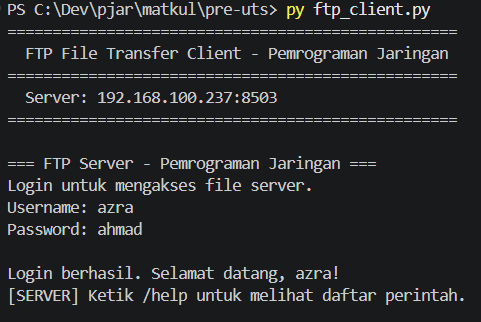
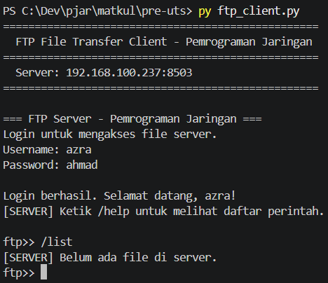
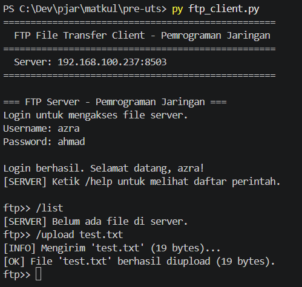
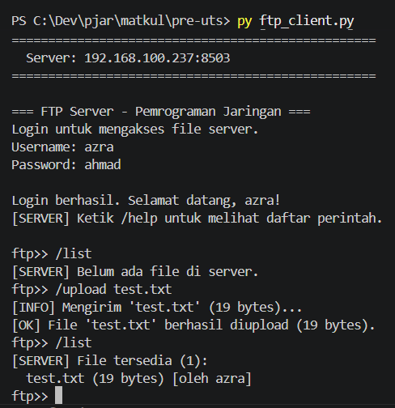
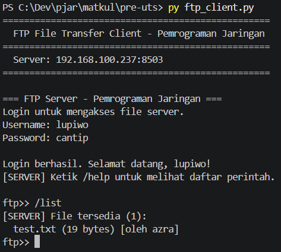
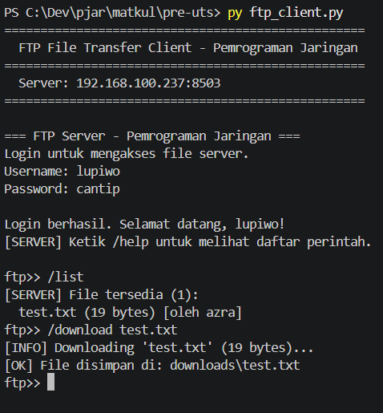
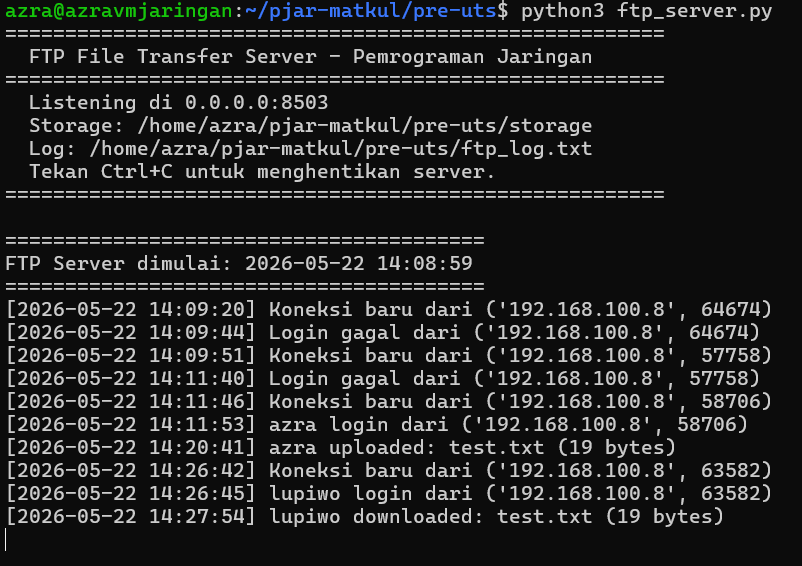

# Tugas Akhir Pre-UTS - FTP File Transfer Application

Aplikasi transfer file sederhana (FTP-like) menggunakan socket programming TCP di Python. Client dapat mengupload dan mendownload file dari server melalui koneksi jaringan.

Link repository Github: https://github.com/azra-ahmad/pjar-matkul/

## Informasi Project

- Mata kuliah: Pemrograman Jaringan
- Bahasa: Python
- Mode tampilan: Command Line Interface (CLI)
- Protokol: TCP
- Platform pengujian: Server di VM Ubuntu (via SSH), client di Windows lokal

## Struktur File

```text
pre-uts/
|-- ftp_server.py        # Server FTP
|-- ftp_client.py        # Client FTP
|-- README.md
|-- storage/             # Folder penyimpanan file di server (auto-generated)
|   `-- <username>/      # Sub-folder per user
`-- downloads/           # Folder hasil download di client (auto-generated)
```

## Penjelasan Program

Program terdiri dari `ftp_server.py` dan `ftp_client.py`. Server berjalan dengan model multi-client menggunakan threading. Setiap client yang terkoneksi dapat melakukan operasi file transfer setelah login.

### Alur Kerja

1. Client terhubung ke server TCP.
2. Server meminta username dan password (3x percobaan).
3. Jika login berhasil, client masuk ke mode FTP.
4. Client dapat menjalankan perintah:
   - `/upload <file>` — upload file dari client ke server
   - `/download <file>` — download file dari server ke client
   - `/list` — lihat daftar file yang tersedia di server
   - `/help` — tampilkan daftar perintah
   - `/quit` — keluar

### Protokol Transfer

**Upload (Client → Server):**
1. Client kirim: `/upload <filename> <filesize>`
2. Server reply: `READY:<filename>`
3. Client kirim raw bytes sejumlah filesize
4. Server reply: `UPLOAD_OK:...` atau `UPLOAD_FAIL:...`

**Download (Server → Client):**
1. Client kirim: `/download <filename>`
2. Server reply: `FILE:<filename>:<filesize>`
3. Client kirim: `READY`
4. Server kirim raw bytes sejumlah filesize

## Fitur Program

- Multi-client menggunakan threading
- Autentikasi username dan password (3x percobaan)
- Upload file dari client ke server (disimpan per-user)
- Download file dari server ke client
- List semua file yang tersedia di server
- Validasi ukuran file maksimal 10 MB
- Sanitasi nama file (mencegah path traversal)
- Logging aktivitas ke file `ftp_log.txt`
- Error handling untuk koneksi terputus dan file tidak ditemukan

## Akun Login

| Username | Password |
| --- | --- |
| `azra` | `ahmad` |
| `lupiwo` | `cantip` |
| `tamu` | `1234` |

Data akun dapat diubah melalui dictionary `USER_DB` pada file `ftp_server.py`.

## Konfigurasi IP dan Port

Server menggunakan IP `0.0.0.0` agar dapat menerima koneksi dari jaringan luar. Client diarahkan ke IP VM.

```python
SERVER_IP = "192.168.100.237"
SERVER_PORT = 8503
```

| Program | Protokol | Port |
| --- | --- | --- |
| `ftp_server.py` | TCP | `8503` |

Jika menggunakan firewall di VM:

```bash
sudo ufw allow 8503/tcp
```

## Cara Menjalankan Program

### Server (di VM Ubuntu)

```bash
cd pre-uts
python3 ftp_server.py
```

### Client (di Windows lokal)

```bash
cd pre-uts
python ftp_client.py
```

### Contoh Penggunaan

Upload file:
```text
ftp>> /upload test.txt
[INFO] Mengirim 'test.txt' (13 bytes)...
[OK] File 'test.txt' berhasil diupload (13 bytes).
```

List file di server:
```text
ftp>> /list
[SERVER] File tersedia (1):
  test.txt (13 bytes) [oleh azra]
```

Download file:
```text
ftp>> /download test.txt
[INFO] Downloading 'test.txt' (13 bytes)...
[OK] File disimpan di: downloads/test.txt
```

## Hasil Testing

Pengujian dilakukan dengan menjalankan server di VM Ubuntu dan dua client di Windows lokal (user `azra` dan `lupiwo`) untuk mendemonstrasikan fitur multi-client dan file sharing antar user.

### Alur Testing

1. Jalankan server di VM.
2. Client pertama (`azra`) login — coba login salah dulu, lalu login benar.
3. Cek `/list` sebelum upload (kosong).
4. Upload file `test.txt` menggunakan user `azra`.
5. Cek `/list` setelah upload — file muncul.
6. Client kedua (`lupiwo`) login, cek `/list` — file dari `azra` terlihat.
7. User `lupiwo` download file `test.txt` yang diupload `azra`.

### Screenshot Hasil Running

#### Server Start di VM



#### Login Gagal (Password Salah)



#### Login Berhasil



#### List Sebelum Upload (Kosong)



#### Upload Berhasil



#### List Setelah Upload



#### List dari POV User Lain (lupiwo)



#### Download Berhasil (User Lain)



#### Server Log



## Output File yang Dihasilkan

| File/Folder | Lokasi | Keterangan |
| --- | --- | --- |
| `ftp_log.txt` | Server | Log aktivitas server |
| `storage/` | Server | Folder penyimpanan file upload (per-user) |
| `downloads/` | Client | Folder hasil download |
